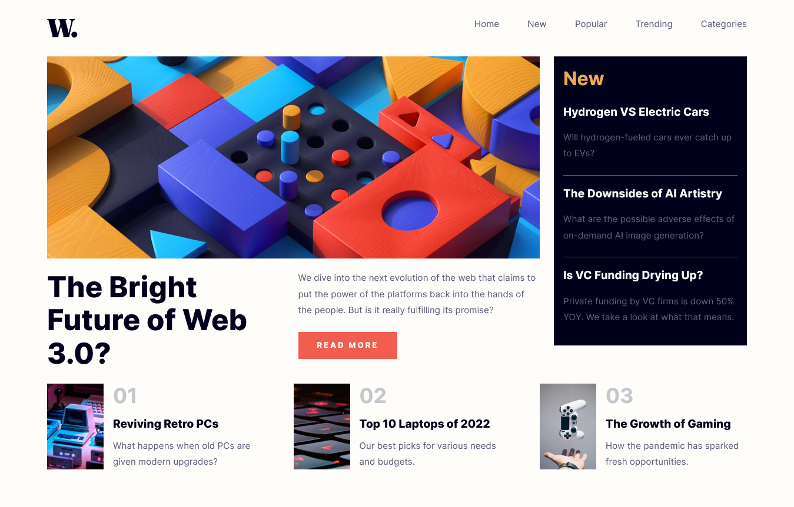

# Frontend Mentor - News homepage solution

This is a solution to the [News homepage challenge on Frontend Mentor](https://www.frontendmentor.io/challenges/news-homepage-H6SWTa1MFl). Frontend Mentor challenges help you improve your coding skills by building realistic projects.

## Table of contents

- [Overview](#overview)
  - [The challenge](#the-challenge)
  - [Screenshot](#screenshot)
  - [Links](#links)
- [My process](#my-process)
  - [Built with](#built-with)
  - [What I learned](#what-i-learned)
  - [Continued development](#continued-development)
  - [Useful resources](#useful-resources)
- [Author](#author)
- [Acknowledgments](#acknowledgments)

## Overview

### The challenge

Users should be able to:

- View the optimal layout for the interface depending on their device's screen size
- See hover and focus states for all interactive elements on the page

### Screenshot



### Links

- Solution URL: [Github](https://github.com/loifloro/news-homepage)
- Live Site URL: [Netlify](https://news-homepage-vue.netlify.app/)

## My process

### Built with

- Semantic HTML5 markup
- CSS custom properties
- Flexbox
- CSS Grid
- Mobile-first workflow
- BEM - CSS Architecture
- Sass
- [Vue](https://vuejs.org) - JavaScript Framework

### What I learned

In this challenge, my main objective was to practice developing with Vue. Here are the things that I've used for the first time:

So I've learned how to use components on Vue by importing it using this syntax.

```js
import Header from "./components/Header.vue";
import New from "./components/New.vue";
import Article from "./components/Articles.vue";
import Footer from "./components/Footer.vue";

export default {
  name: "App",
  components: {
    Header,
    New,
    Article,
    Footer,
  },
};
```

In the mobile menu, I used v-onclick feature of Vue to toggle open and close.

```html

```

Another feature of Vue that I have used is Transition to put fade transitioning the mobile menu

```js
<Transition name="fade">
```

To put multiple articles in Article components, I utilized the v-for feature of Vue

```html
<div class="article__item" v-for="article in articles" :key="article">
  
  <div>
    <h3 class="article__number">{{ article.number }}</h3>
    <h4 class="article__title">{{ article.title }}</h4>
    <p class="article__desc">{{ article.description }}</p>
  </div>
</div>
```

When deploying the project to Netlify, I've encountered build fail not knowing that the deploy settings on Netlify should have an environment variable

```js
NODE_VERSION=18.13.0
```

### Continued development

On the next project, I will try to design my own web app that will be also built on Vue to get familiar with this framework

### Useful resources

- [Vue JS for Beginner](https://www.youtube.com/playlist?list=PL4cUxeGkcC9hYYGbV60Vq3IXYNfDk8At1) - This is what I'm currently studying. It's easy to digest to get a grip on Vue.

## Author

- Github - [loifloro](https://github.com/loifloro/)
- Frontend Mentor - [@loifloro](https://www.frontendmentor.io/profile/loifloro)
- Twitter - [@loisfloro](https://www.twitter.com/loisfloro)

## Acknowledgments

I like to thank Net Ninja for his free Vue JS tutorial. More power to you!
